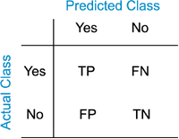

```{r setup, include=FALSE}
knitr::opts_chunk$set(echo = FALSE, fig.path = 'modelSkill_chetco_figures/', fig.keep = 'high')
# Load packages
library(AirfireNasaMaiac)
library(PWFSLSmoke)
library(PWFSLSmokeModeling)
library(raster)
logger.setup()


# Load data
setSpatialDataDir(params$spatialDataDir)

loadSpatialData("USCensusStates")

# Load chetco dataframe
load("../localData/chetco_maiac_dataframe.Rdata")
dfall <- chetcodf
```

In this notebook, we use logistic regression to determine which AOT values best correspond to AQI thresholds as a means of translating from AOT to AQI. Then, we perform skill analysis at each of these thresholds to assess the usefulness of using MAIAC AOT values for estimating PM2.5 and AQI categories.

## Determining AQI thresholds for AOT

Here, we perform a logistic regression at each AQI threshold, with AOT as the continuous predictor. The response is binary: true when the monitoring PM25 3-hour rolling mean is greather than the AQI threshold, false when it is less. 
We estimate AOT thresholds corresponding to AQI thresholds by solving for $p$ = 0.5. That is, we find the AOT value at which the model predicts that the probability of PM25 being over the AQI threshold is 0.5. We can also use these models to estimate the probability that PM2.5 at a location was over a given threshold based on the AOT value. The models are summarized below. 

A more thorough explanation of logistic regression and how these values were calculated can be found in `localNotebooks/maiac_0612_thresholds.html`.


McFadden’s R2 is used as a method of assessing the model fit. It can be thought of as a pseudo-R2 value. It ranges from 0 to 1, with larger values indicating a better fit. The intercept can be interpreted as the predicted odds (1/(1-p)) of the PM25 value being over the threshold when AOT is 0, and the odds are predicted to increase by a factor of the slope value for one unit increase in AOT.

```{r models, warning=FALSE}
dfall$moderate <- ifelse(dfall$monitor > 12, TRUE, FALSE)
dfall$usg <- ifelse(dfall$monitor > 35.5, TRUE, FALSE)
dfall$unhealthy <- ifelse(dfall$monitor > 55.5, TRUE, FALSE)
dfall$veryunhealthy <- ifelse(dfall$monitor > 150.5, TRUE, FALSE)
dfall$hazardous <- ifelse(dfall$monitor > 250.5, TRUE, FALSE)

moderateglm <- glm(moderate~satellite, data = dfall, family = binomial)
moderateThreshold <- -(moderateglm$coefficients[1]/moderateglm$coefficients[2])

usgglm <- glm(usg~satellite, data = dfall, family = binomial)
usgThreshold <- -(usgglm$coefficients[1]/usgglm$coefficients[2])

unhealthyglm <- glm(unhealthy~satellite, data = dfall, family = binomial)
unhealthyThreshold <- -(unhealthyglm$coefficients[1]/unhealthyglm$coefficients[2])

veryunhealthyglm <- glm(veryunhealthy ~ satellite, data = dfall, family = binomial)
veryunhealthyThreshold <- -(veryunhealthyglm$coefficients[1]/veryunhealthyglm$coefficients[2])

hazardousglm <- glm(hazardous ~ satellite , data = dfall, family = binomial)
hazardousThreshold <- -(hazardousglm$coefficients[1]/hazardousglm$coefficients[2])

thresholds <- c(moderateThreshold, usgThreshold, unhealthyThreshold, veryunhealthyThreshold, hazardousThreshold)
intercepts <- exp(c(moderateglm$coefficients[1], usgglm$coefficients[1], unhealthyglm$coefficients[1], veryunhealthyglm$coefficients[1], hazardousglm$coefficients[1]))
slopes <- exp(c(moderateglm$coefficients[2], usgglm$coefficients[2], unhealthyglm$coefficients[2], veryunhealthyglm$coefficients[2], hazardousglm$coefficients[2]))
mcfadden <- c(pscl::pR2(moderateglm)[4], pscl::pR2(usgglm)[4], pscl::pR2(unhealthyglm)[4], pscl::pR2(veryunhealthyglm)[4], pscl::pR2(hazardousglm)[4])

knitr::kable(data.frame(AQI = AQI$names[-1], pm25 = AQI$breaks_24[2:6], AOT_threshold = thresholds, intercept = intercepts, slope = slopes, McFadden_R2 = mcfadden))

```

## AQI threshold plot


```{r thresholdPlot}
plot(dfall$satellite, dfall$monitor, main = "Oct 08-13 AQUA and TERRA", ylab = "monitoring data (PM2.5 ug/m3)", xlab = "satellite data (AOT)", xlim = c(0,2.5), ylim = c(0,325))
abline(lm(dfall$monitor~dfall$satellite), lty = 2, col = adjustcolor(1, alpha.f = .8))
points(AQI$breaks_24[2:6]~ thresholds, col = AQI$colors[-1], pch = 16)
abline(h = AQI$breaks_24[-1], col = adjustcolor(AQI$colors[-1], alpha.f = .6), lwd = 2)
abline(v = thresholds, col = adjustcolor(AQI$colors[-1], alpha.f = .6), lwd = 2)
```


## Model analysis and skill

While the McFadden's R2 values were generally pretty high for these models, this does not tell the whole story. For example, higher AQI thresholds have very few points that exceed them, which means that there may not be enough data to fit a really meaningful model. The following plots help visualize the distribution of data, and help explain some of these challenges by showing how AOT is related to the AQI threshold. AOT is on the x-axis. The y-axis is binary, with points on top at 1 or TRUE when the monitor PM25 value exceeded the threshold, or at 0 or FALSE when it did not. They also include a line showing the predicted probability that the monitor PM25 value will exceed the threshold given a value for AOT.

```{r logisticPlots}
par(mar = c(5,4,4,3), mfrow = c(2,3))
plot(dfall$satellite, dfall$moderate, xlab = "AOT", ylab = "Moderate or worse", yaxt = 'n', main = "Moderate (12)")
axis(2, at = c(0, 1), labels = c("FALSE", "TRUE"))
axis(4, at = c(0, .5,  1), labels = c("0", "0.5", "1"))
curve(exp(moderateglm$coefficients[1] + moderateglm$coefficients[2] * x)/(1 + exp(moderateglm$coefficients[1] + moderateglm$coefficients[2] * x)), add = TRUE)

plot(dfall$satellite, dfall$usg, xlab = "AOT", ylab = "USG or worse", yaxt = 'n', main = "Unsafe for Sensitive Groups (35)")
axis(2, at = c(0, 1), labels = c("FALSE", "TRUE"))
axis(4, at = c(0, .5,  1), labels = c("0", "0.5", "1"))
curve(exp(usgglm$coefficients[1] + usgglm$coefficients[2] * x)/(1 + exp(usgglm$coefficients[1] + usgglm$coefficients[2] * x)), add = TRUE)

plot(dfall$satellite, dfall$unhealthy, xlab = "AOT", ylab = "Unhealthy or worse", yaxt = 'n', main = "Unhealthy (55)")
axis(2, at = c(0, 1), labels = c("FALSE", "TRUE"))
axis(4, at = c(0, .5,  1), labels = c("0", "0.5", "1"))
mtext("Probability", 4, 2, cex = .8)
curve(exp(unhealthyglm$coefficients[1] + unhealthyglm$coefficients[2] * x)/(1 + exp(unhealthyglm$coefficients[1] + unhealthyglm$coefficients[2] * x)), add = TRUE)

plot(dfall$satellite, dfall$veryunhealthy, xlab = "AOT", ylab = "Very Unhealthy or worse", yaxt = 'n', main = "Very Unhealthy (150)")
axis(2, at = c(0, 1), labels = c("FALSE", "TRUE"))
axis(4, at = c(0, .5,  1), labels = c("0", "0.5", "1"))
curve(exp(veryunhealthyglm$coefficients[1] + veryunhealthyglm$coefficients[2] * x)/(1 + exp(veryunhealthyglm$coefficients[1] + veryunhealthyglm$coefficients[2] * x)), add = TRUE)

plot(dfall$satellite, dfall$hazardous, xlab = "AOT", ylab = "Hazardous or worse", yaxt = 'n', main = "Hazardous (250)")
axis(2, at = c(0, 1), labels = c("FALSE", "TRUE"))
axis(4, at = c(0, .5,  1), labels = c("0", "0.5", "1"))
mtext("Probability", 4, 2, cex = .8)
curve(exp(hazardousglm$coefficients[1] + hazardousglm$coefficients[2] * x)/(1 + exp(hazardousglm$coefficients[1] + hazardousglm$coefficients[2] * x)), add = TRUE)

```

## Skill

Several skill meterics are reported here. The first is the confusion matrix for each threshold. It follows this form: 

  

The skill metrics reported here are: 

##### Prevalence
 This is the proportion of observed values that were true. Calculated: (FN + TP)/total
 
##### Accuracy
 This is the proportion of predictions that were correct. (TP + TN)/total
 
##### True Positive Rate (TPR)
 This tells us how often the model was right out of all the true positives. TP/(TP + FN)
 
##### False Positive Rate (FPR)
 This tells us how often the model was wrong when the actual value was False. FP/(FP + TN)
 
##### Specificity (or True Negative Rate)
 This tells us how often the model was right when the true value is False. TN/(FP + TN)
 
##### Precision (or False Alarm Ratio)
 This tells us how often the model was correct when it predicted True. TP/(TP + FP)
 
```{r skill}
moderateskill <- skill_confusionMatrix(dfall$satellite > moderateThreshold, dfall$moderate)
usgskill <- skill_confusionMatrix(dfall$satellite > usgThreshold, dfall$usg)
unhealthyskill <- skill_confusionMatrix(dfall$satellite > unhealthyThreshold, dfall$unhealthy)
veryunhealthyskill <- skill_confusionMatrix(dfall$satellite > veryunhealthyThreshold, dfall$veryunhealthy)
hazardousskill <- skill_confusionMatrix(dfall$satellite > hazardousThreshold, dfall$hazardous)

skillInfo <- data.frame(AQI = AQI$names[-1], PM25 = AQI$breaks_24[2:6], AOT = thresholds, 
                        prevalence = c(moderateskill$prevalence, usgskill$prevalence, unhealthyskill$prevalence, 
                                       veryunhealthyskill$prevalence, hazardousskill$prevalence),
                        accuracy = c(moderateskill$accuracy, usgskill$accuracy, unhealthyskill$accuracy, 
                                     veryunhealthyskill$accuracy, hazardousskill$accuracy),
                        TPR = c(moderateskill$TPRate, usgskill$TPRate, unhealthyskill$TPRate, 
                                veryunhealthyskill$TPRate, hazardousskill$TPRate),
                        FPR = c(moderateskill$FPRate, usgskill$FPRate, unhealthyskill$FPRate, 
                                veryunhealthyskill$FPRate, hazardousskill$FPRate),
                        specificity = c(moderateskill$specificity, usgskill$specificity, unhealthyskill$specificity, 
                                        veryunhealthyskill$specificity, hazardousskill$specificity),
                        precision = c(moderateskill$precision, usgskill$precision, unhealthyskill$precision, 
                                      veryunhealthyskill$precision, veryunhealthyskill$precision))
```

### Confusion Matrices

##### Moderate  
```{r moderateskill}
moderateskill$table
```

##### Unsafe for Sensitive Groups  
```{r usgskill}
usgskill$table
```

##### Unhealthy  
```{r unhealthyskill}
unhealthyskill$table
```

##### Very Unhealthy  
```{r veryunhealthyskill}
veryunhealthyskill$table
```

##### Hazardous  
```{r hazardousskill}
hazardousskill$table
```

### Other skill metrics

```{r skillInfo}
knitr::kable(skillInfo)
```

### All metrics for Unhealthy

```{r allmetrics}
str(unhealthyskill)
```


