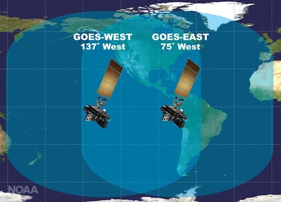
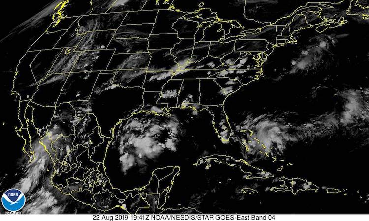

```{r setup, include=FALSE}
knitr::opts_chunk$set(echo = TRUE, fig.align = 'center')
```

## Western Exclusion

Aerosol optical depth readings from the GOES-East satellite are each labeled
with a data quality flag ranging from 0 to 2 (high to low) including an 
additional flag, 3, for "no retrieval flag". Plotting data with no quality 
restrictions typically results in an image like the following:

<center>


</center>

While clouds and snow might leave many regions spotty or obscured, we can see 
that there is at least *some* coverage across the whole continental United 
States. However, when plotting only medium and/or high quality data we notice 
something interesting:

<center>


</center>

As we should expect, quite a lot points have been removed--leaving many regions 
much more bare than before. However, while eastern states still 
retain some dense clouds of points, **all** readings from the west coast have 
been entirely swept away. There isn't a single point left in Washington, Oregon,
and Idaho, and large portions of Montana, Nevada, and California have been 
completely removed.

From the image above one can make out the apparent "shape" of this retained 
data. A well defined arc from North Dakota to California seems to be the border
of a circular area between low quality data and the rest. Everything within this
region is kept while the rest is thrown away. Unfortunately, while the central 
and eastern United States falls within this radius, much of the west coast does 
not. Similar plots at different times confirm that this boundary is fixed both 
in location and size.

So what is this boundary and why does it exist? 

## Satellite Angle Limitations

Due to GOES-East's geostationary orbit over the equator at 75.0W, the 
satellite's ABI scanner is limited to only covering the area shown below:

<center>



</center>

The satellite has a clear view of the regions directly below it, but due to the
curvature of the Earth, the further the scanner looks out the more distorted its
view becomes. Southeastern states like Florida can be scanned almost 
straight-on, but those on the opposite coast like Washington, Oregon, and 
California can only be seen at a very shallow angle.

<center>



</center>

Part of what separates low quality readings from the rest is the local zenith 
angle (LZA) of the observation points. The 
[GOES-R documentation](https://www.goes-r.gov/products/docs/PUG-L2+-vol5.pdf) 
defines this measurement on page 36:

* Local zenith angle: The angle between the line of sight to the satellite and 
the zenith at the observation target. ("Viewing zenith angle" in the diagram)

<center>


</center>

The documentation states that: "There are many ABI Level 2+ products where the 
local zenith angle has an adverse effect on the quality of product data or 
precludes its generation". For the aerosol optical depth product, readings at 
locations with a LZA of less than 60.0 degrees are labeled as "good" (p. 246).

As locations get further and further away from the satellite, their local zenith
angle grows larger and larger. It is possible that the circular limit we found
earlier is defined by this 60 degree angle constraint. Readings at the edge of
that curve might have a LZA just barely under 60, while those in west coast
states have LZAs too large to be labelled as high or medium quality.
