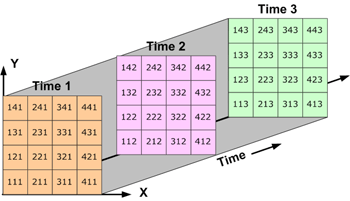

  
```{r setup, include=FALSE}
knitr::opts_chunk$set(echo = TRUE, fig.align = 'center')
```

## NetCDF

> The Aerosol Optical Depth product is delivered using netCDF version 4 product files.  NetCDF includes constructs to define scalar and multi-dimensional data, along with the associated metadata.  This standard includes requirements that allow the data to be located in space and time, as well as the semantics of the data captured in the product file.

\* From the [GOES R-Series Product User Guide](https://www.goes-r.gov/products/docs/PUG-L2+-vol5.pdf).

NetCDF (Network Common Data Form) files are self-describing, machine-independent data formats that support the creation, access, and sharing of array-oriented scientific data.  They are used for storing multidimensional scientific data (variables) such as temperature, humidity, pressure, wind speed, and direction. Each of these variables can be displayed through a dimension (such as time or geographic location).  NetCDF was developed and is maintained at Unidata, which is part of the University Corporation for Atmospheric Research (UCAR) Community Programs (UCP) and is a standard in the scientific community for sharing data.

Generally speaking, a netCDF file can be viewed as a multidimensional grid, or raster, file.  They are often used to store _n(x, y, z)_ data where the scientific data _(n)_ are linked to one-dimensional spatial _(x, y)_ and time _(z)_ coordinates.  These dimensional coordinates are strictly monotonic (values increasing or decreasing) and are full, meaning that there are no missing or NA values.  The scientific data itself may have missing values which are usually identified with a specific value that falls outside of the data's valid instrument range such as -1 or 999.

<center>

</center>

## AOD Data Dictionary

AOD NetCDF files follow the conventions set forth in [COARDS](https://ferret.pmel.noaa.gov/Ferret/documentation/coards-netcdf-conventions).  Anyone wishing to enhance the **MazamaSatelliteUtils** package should take a moment to acquaint themselves with these conventions.  An overview of key aspects of the CONUS GOES AOD NetCDF file will be provided below, but will not cover all aspects related to it.

#### Pertinent metadata from a GOES-17 AOD NetCDF file.

```
netcdf OR_ABI-L2-AODC-M6_G17_s20193001616196_e20193001618569_c20193001621030 {
dimensions:
        y = 1500 ;
        x = 2500 ;
variables:
     short AOD(y, x) ;
                AOD:_FillValue = -1s ;
                AOD:long_name = "ABI L2+ Aerosol Optical Depth at 550 nm" ;
                AOD:standard_name = "atmosphere_extinction_optical_thickness_due_to_ambient_aerosol" ;
                AOD:_Unsigned = "true" ;
                AOD:valid_range = 0s, -6s ;
                AOD:scale_factor = 7.706e-05f ;
                AOD:add_offset = -0.05f ;
                AOD:units = "1" ;
                AOD:resolution = "y: 0.000056 rad x: 0.000056 rad" ;
                AOD:grid_mapping = "goes_imager_projection" ;
                AOD:ancillary_variables = "DQF" ;
      byte DQF(y, x) ;
                DQF:_FillValue = -1b ;
                DQF:long_name = "ABI L2+ Aerosol Optical Depth at 550 nm data quality flags" ;
                DQF:standard_name = "status_flag" ;
                DQF:_Unsigned = "true" ;
                DQF:valid_range = 0b, 3b ;
                DQF:units = "1"  ;
                DQF:grid_mapping = "goes_imager_projection" ;
                DQF:flag_values = 0b, 1b, 2b, 3b ;
                DQF:flag_meanings = "high_quality_retrieval_qf
                                     medium_quality_retrieval_qf
                                     low_quality_retrieval_qf
                                     no_retrieval_qf" ;
                DQF:number_of_qf_values = 4b ;
       short y(y) ;
                y:scale_factor = -5.6e-05f ;
                y:add_offset = 0.128212f ;
                y:units = "rad" ;
                y:axis = "Y" ;
                y:long_name = "GOES fixed grid projection y-coordinate" ;
                y:standard_name = "projection_y_coordinate" ;
       short x(x) ;
                x:scale_factor = 5.6e-05f ;
                x:add_offset = -0.069972f ;
                x:units = "rad" ;
                x:axis = "X" ;
                x:long_name = "GOES fixed grid projection x-coordinate" ;
                x:standard_name = "projection_x_coordinate" ;
       int goes_imager_projection ;
                goes_imager_projection:long_name = "GOES-R ABI fixed grid projection" ;
                goes_imager_projection:grid_mapping_name = "geostationary" ;
                goes_imager_projection:perspective_point_height = 35786023. ;
                goes_imager_projection:semi_major_axis = 6378137. ;
                goes_imager_projection:semi_minor_axis = 6356752.31414 ;
                goes_imager_projection:inverse_flattening = 298.2572221 ;
                goes_imager_projection:latitude_of_projection_origin = 0. ;
                goes_imager_projection:longitude_of_projection_origin = -137. ;
                goes_imager_projection:sweep_angle_axis = "x" ;
```

#### Dimensions

The Metadata above shows dimensions comprised of _x_ and _y_ variables with a length of 2500 for _x_ and 1500 for _y_.
```
dimensions:
        y = 1500 ;
        x = 2500 ;
```
This corresponds to a rectangular grid that is 2500 cells (or pixels) wide and 1500 pixels tall.

### Description of AOD Variable
#### Variable type and dimensions
```
short AOD(y, x) ;
```

The data type of the AOD variable is defined as _short_, meaning short (or 16-bit) integer.  The AOD variable is associated with _x_ and _y_ dimension variables, meaning that there will be an _(x, y)_ value associated with each AOD value.

#### Numeric range and FillValue
```
AOD:_FillValue = -1s ;
AOD:_Unsigned = "true" ;
AOD:valid_range = 0s, -6s ;
```
As read from the NetCDF file, the raw AOD values contain _-1_  as a _FillValue_ to indicate _No Data_.  Additionally the data values are  _Unsigned_ (more on this below),  and the _valid\_range_ of the data is from 0 to -6 _short integers_.  This may be confusing to the user, so additional explanation is provided below.

### Signed vs. Unsigned Integer Storage in NetCDF

By definition, a numeric variable is _signed_ if it can represent both positive and negative numbers, and _unsigned_ if it can only represent non-negative numbers (zero or positive numbers).  Aside from having the ability to store negative values, a _signed_ data set differs from an _unsigned_ one in that it can only store a positive number that is half as large as one in an _unsigned_ set.  This is because the integer type defines the maximum storage space that can be allocated for each integer.  So in the case of an _unsigned short_ integer, the number of values that could be stored is 65,536 or 2^16, with a range of [0, 65535] (Remember that 0 counts as a value and takes up one position).   If the data type were _signed short_, then the number of values is still limited to 65,536 but the valid range would be [-32768, 32767]. (In binary, bit 1 stores 2^0, bit 2 stores 2^1, _etc._ For _unsigned short_ bit 16 is used to store 2^15 but for _signed_short_ bit 16 is used to store -2^15.)

#### NetCDF implementation of unsigned integers

In the case of AOD data, the `Unsigned = "true";` metadata tag tells us that we should only have positive numbers in the data.  However, while the netCDF version 4 format supports the use of unsigned integers as externally defined data types, library functions still interpret the data as signed integers.  In a data like this, when negative values are present in what should be an _unsigned_  data type, it is an indication that the original value exceeded the maximum positive value allowed for in the _signed_ representation. The **MazamaSatelliteUtils** package manages this by reading in raw bytes and correctly interpreting them as _unsigned int_:

```
AOD:valid_range = 0s, -6s
    translates to
valid range = [0, 65536 -6]
    or
AOD:valid_range = 0, 65530
```

\* Additional information on NetCDF data types can be found at https://www.unidata.ucar.edu/software/netcdf/docs/data_type.html

## Time Conventions in AOD Data

(TODO:  Talk about ordinal/Julian date format here)
