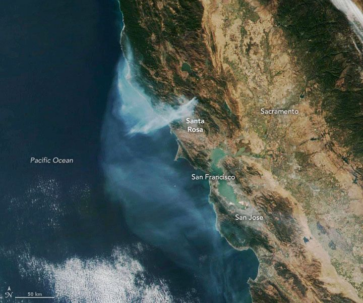

  
```{r setup, include=FALSE}
knitr::opts_chunk$set(echo = TRUE)
```
  
  The Kincade Fire, which burned in Sonoma County from October 23 to November 6, was the largest wildfire in California during 2019 and the largest fire ever in Sonoma County.  This example will show the smoke movement from this fire during the day on October 29, 2019 using the _MazamaSatelliteUtils_ R package.  In it, we will check for data on the server, download it, visualize it in several ways and finally create a movie which shows smoke movement during the day.


  
### Setup Work Environment
  
  In order to analyze the AOD levels for the Daytime period on Oct 29, a great many files will need to be downloaded and processed.  It will be beneficial to specify a project directory for this particular project, where only data pertaining to this specific date and location is stored.
  
```{r env_setup, message=FALSE}  
library(MazamaSatelliteUtils)
library(MazamaSpatialUtils)
setSatelliteDataDir("~/Data/kincade")
```
### Check Data Availability
  
  GOES-West AOD data became available from the BlueSky/Fire site beginning on August 28, 2019.  In order to have a sense of how much data we will need to obtain for this project, our first step will be to check on the Fire server to see what AOD data is available on that day.  Furthermore, as we are only interested in seeing what data is available during local daytime hours in Sonoma, CA, we will limit our file-listing to only Daytime hours.
  
```
goesaodc_listDaytimeFiles(satID = "G17", 
                          datetime = "2019-10-29", 
                          timezone = "America/Los_Angeles", 
                          useRemote = TRUE)
  
  [1] "OR_ABI-L2-AODC-M6_G17_s20193021401196_e20193021403569_c20193021404452.nc"
  [2] "OR_ABI-L2-AODC-M6_G17_s20193021406196_e20193021408569_c20193021409556.nc"
  [3] "OR_ABI-L2-AODC-M6_G17_s20193021411196_e20193021413569_c20193021414550.nc"
  [4] "OR_ABI-L2-AODC-M6_G17_s20193021416196_e20193021418569_c20193021419500.nc"
  [5] "OR_ABI-L2-AODC-M6_G17_s20193021421196_e20193021423569_c20193021424570.nc"
  [6] "OR_ABI-L2-AODC-M6_G17_s20193021426196_e20193021428569_c20193021429586.nc"
  [7] "OR_ABI-L2-AODC-M6_G17_s20193021431196_e20193021433569_c20193021434537.nc"
  <snip>
    [138] "OR_ABI-L2-AODC-M6_G17_s20193030126196_e20193030128569_c20193030130466.nc"
  [139] "OR_ABI-L2-AODC-M6_G17_s20193030131196_e20193030133569_c20193030135512.nc"
  [140] "OR_ABI-L2-AODC-M6_G17_s20193030136196_e20193030138569_c20193030141011.nc"
  [141] "OR_ABI-L2-AODC-M6_G17_s20193030141196_e20193030143569_c20193030145552.nc"
  [142] "OR_ABI-L2-AODC-M6_G17_s20193030146196_e20193030148569_c20193030151118.nc"
  [143] "OR_ABI-L2-AODC-M6_G17_s20193030151196_e20193030153569_c20193030156149.nc"
  [144] "OR_ABI-L2-AODC-M6_G17_s20193030156196_e20193030158569_c20193030201120.nc"
```
  
As we can see from the date strings in the truncated file listing output above, there are 144 files available during the Daytime hours of October 29th.  These files span the datetimes from _s20193021401196_ until _e20193030158569_.  Some explanation about how to read these date strings is shown here.
  
```
  s20193021401196...
  s    = "start"
  2019 = Year
  302  = Ordinal Day
  14   = 24hr Day Hour
  01   = Minute
  19   = Seconds 
  6    = Milliseconds
  
  e20193030158569...
  e     = "end"
  2019  = Year
  303   = Ordinal Day
  01    = 24hr Day Hour
  58    = Minutes
  56    = Seconds
  9     = Milliseconds
```
  
In other words, the files needed to display AOD during Daytime hours span from roughly _2019-10-29 14:00 UTC_ until _2019-10-30 01:00 UTC_.  `goesaodc_listDaytimeFiles()` automatically took the input date of "2019-10-29" and the Olson timezone of "America/Los_Angeles" and performed the calculations needed to obtain the Sunrise and Sunset times for that timezone on that date.  We can verify those times using the `getDaylightHours()` utility function that is included in the package.
  
```
getDaylightHours(datetime = "2019-10-29", timezone = "America/Los_Angeles")
$sunrise
[1] "2019-10-29 07:02:54 PDT"
  
$sunset
[1] "2019-10-29 18:18:57 PDT"
```
And when we convert those times back into  UTC, we see that we match the start and end times of our available files.
  
```
start <- MazamaCoreUtils::parseDatetime("2019-10-29 07:02:54", timezone = "America/Los_Angeles")
end <- MazamaCoreUtils::parseDatetime("2019-10-29 18:18:57", timezone = "America/Los_Angeles")
  
lubridate::with_tz(start, tzone = "UTC")
[1] "2019-10-29 14:02:54 UTC"

lubridate::with_tz(end, tzone = "UTC")
[1] "2019-10-30 01:18:57 UTC"
```
__NOTE:__ It is important to remember that __MazamaSatelliteUtils__ uses the entire hour as it's base unit of time. 

### Download the Data

Downloading the AOD data for our timespan of interest can be easily accomplished by using the `goesaodc_downloadDaytimeAOD()` function, which works very similarly to `goesaodc_listDaytimeFiles()`.

```{r file_download, message = FALSE}
goesaodc_downloadDaytimeAOD(satID = "G17", 
                            datetime = "2019-10-29", 
                            timezone = "America/Los_Angeles", 
                            verbose = TRUE)

#Downloaded OR_ABI-L2-AODC-M6_G17_s20193021401196_e20193021403569_c20193021404452.nc
#Downloaded OR_ABI-L2-AODC-M6_G17_s20193021406196_e20193021408569_c20193021409556.nc
#Downloaded OR_ABI-L2-AODC-M6_G17_s20193021411196_e20193021413569_c20193021414550.nc
#<snip>
```
__NOTE:__ By default the download function does not show the filenames being downloaded. The "verbose" parameter must be set to "TRUE" in order for them to display.

An alternative method to download the files would be to use the core `goesaodc_downloadAOD()` function with a time range that corresponds to the Daylight hours obtained earlier using `getDaylightHours()`.  An example of this method is shown below, as it is a useful way to obtain a smaller range of time than a full day.

<center>
__Example of AOD download using starting and ending times__
</center>

```
goesaodc_downloadAOD(satID = "G17", datetime = "2019-10-29 07", endTime = "2019-10-29 18", timezone = "America/Los_Angeles")
```

### Verify Files Have Downloaded

Whichever way you've decided to download the files, it's now a good idea to make sure that you've downloaded the data that you think you have.  This is particularly a good idea if you have done the download without specifying "verbose = TRUE".  If we use `goesaodc_listDaytimeFiles()` in it's default mode, with `useRemote = FALSE`, we can confirm that we have 144 files downloaded and residing in our project directory, which we set using `setSatteliteDataDir`. 

```
goesaodc_listDaytimeFiles(satID = "G17", 
                          datetime = "2019-10-29", 
                          timezone = "America/Los_Angeles")
<snip>
[140] "OR_ABI-L2-AODC-M6_G17_s20193030136196_e20193030138569_c20193030141011.nc"
[141] "OR_ABI-L2-AODC-M6_G17_s20193030141196_e20193030143569_c20193030145552.nc"
[142] "OR_ABI-L2-AODC-M6_G17_s20193030146196_e20193030148569_c20193030151118.nc"
[143] "OR_ABI-L2-AODC-M6_G17_s20193030151196_e20193030153569_c20193030156149.nc"
[144] "OR_ABI-L2-AODC-M6_G17_s20193030156196_e20193030158569_c20193030201120.nc"
```

### First Look at Data

There are a variety of ways to visualize the AOD data, but for now, it's handy to just have a look at a single snapshot of the data.  To do that, we select a file from the set we downloaded earlier, crop it to the area near Santa Rosa, CA, and have a look at it.  But first we run `installGoesGrids()` to create the spatial grids that will be used to tie the pixel data from the satellite image to points on the ground


```{r first_view, message=FALSE, fig.align='center', fig.height=7, fig.width=7, fig.asp=.987}
installGoesGrids()
nc_file <- goesaodc_listFiles(satID = "G17", 
                                     datetime = "2019-10-29 10", 
                                     timezone = "America/Los_Angeles")[1]
nc_handle <- goesaodc_openFile(nc_file)

kincade_bbox <- c(-125, -120, 36, 40)

goesaodc_areaPlot(list(nc_handle), kincade_bbox)
```
  
We can clearly see the heavy smoke plume coming out of the Santa Rosa region towards the Southwest, as well as dense smoke that is drifting throughout the rest of the Bay Area.

### Create a movie from data

It's relatively straight-forward to create a movie of the AOD changes throught the day.  Use the `createSpatialPointsVideo_exec.R` file located in _local_executables_.  It requires that [ffmpeg](https://www.ffmpeg.org/) be installed.  To create the movie, execute the following command:

```
./createSpatialPointsVideo_exec.R --datetime="2019-10-29" \
-s CA -x AOD -q 3 -r 2 -o ~/Desktop/ -v TRUE \
--SpatialDataDir="~/Data/Spatial" \
--SatelliteDataDir="~/Data/kincade" \
--bbox="-124, -120, 36.5, 40.5" \
--fullDay="TRUE"
```
  
  
