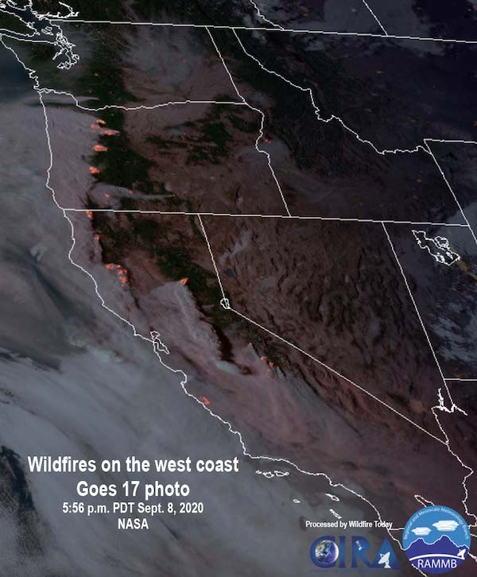

  
```{r setup, include=FALSE}
knitr::opts_chunk$set(echo = TRUE)
```

This article will walk through how to use high-level functions from the 
**MazamaSatelliteUtils** package to load and visualize satellite AOD data. With 
these functions we will explore a day in Oregon's 2020 wildfire season.

### Satellite Image

Several large wildfires were blazing in Oregon on September 8th, 2020. Here is
an image taken by GOES 17 of the west coast that day, where we can see that much 
of the smoke generated by these fires was being blown west towards the Pacific.

{width=60%}

Image from [Wildfire Today](https://wildfiretoday.com/2020/09/08/strong-winds-spread-numerous-wildfires-in-oregon-and-washington/).

### Plots

We can visualize the AOD readings at the same time as the image above by using 
the `goesaodc_plotScanPoints()` function. This function allows you to draw a 
plot of spatial points for a scan specified by a satellite ID and time. Since 
the GOES 16 and 17 satellites take scans about every 5 minutes, the scan closest
to the requested time will be drawn.

```{r, fig.width = 7, fig.height = 5, fig.align = "center"}
# Set up MazamaSatelliteUtils package
library(MazamaSatelliteUtils)
setSatelliteDataDir("~/Data/Satellite")

# Load state polygons
MazamaSpatialUtils::setSpatialDataDir("~/Data/Spatial")
MazamaSpatialUtils::loadSpatialData("NaturalEarthAdm1")
  
bbox_oregon <- c(-125, -116, 42, 47)
  
# Plot Oregon at 5:56pm on Sep. 8, 2020
goesaodc_plotScanPoints(
  satID = "G17",
  datetime = "2020-09-08 17:56",
  timezone = "America/Los_Angeles",
  bbox = bbox_oregon,
  stateCodes = "OR",
  title = "Oregon AOD at 5:56pm PDT on Sep. 8, 2020"
)
```

Like the satellite image, this AOD plot shows streams of smoke blowing 
west from the wildfires and forming a thick layer of smog over the coast. You 
can also see a slightly less dense cloud of smoke hanging over the state's
eastern border--a result of the Woodhead Fire in Idaho.

We can sum up the whole hour from 5pm - 6pm by also setting the `endtime` 
parameter. All of the scans from `datetime` (inclusive) up to `endtime` 
(exclusive) have their readings averaged together in the final plot:

```{r, fig.width = 7, fig.height = 5, fig.align = "center"}
# Plot Oregon from 5pm to 6pm on Sept. 8, 2020
goesaodc_plotScanPoints(
  satID = "G17",
  datetime = "2020-09-08 17",
  endtime = "2020-09-08 18",
  timezone = "America/Los_Angeles",
  bbox = bbox_oregon,
  stateCodes = "OR",
  title = "Oregon AOD from 5pm to 6pm PDT on Sept. 8, 2020"
)
```

As you can see, the smoke streams have become more well-defined when averaged
over time, and we can start to make out some details that weren't clear from the
5:56pm snapshot (such as the two stationary plumes in the southwest of the 
state). However, the longer the time range, the more likely it is that point
values will average out or "smear" if the wind changes direction.
