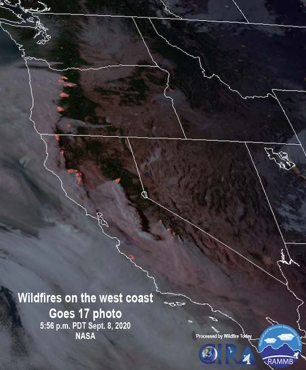

  
```{r setup, include=FALSE}
knitr::opts_chunk$set(echo = TRUE)
```

This article will walk through how to plot GOES AOD scans using high-level 
functions available in the **MazamaSatelliteUtils** package.

## Point and Raster Plots 

Each GOES scan records the AOD and data quality values of millions of 
(fixed) locations across the continental US. **MazamaSatelliteUtils** allows you
to visualize this AOD data either as individual points using 
`goesaodc_plotScanPoints()` or as a single raster using 
`goesaodc_plotScanRaster()`. Points and rasters each have their own upsides and 
downsides when it comes to plotting.

### Point Plots

**Pros:**

- Points display raw (unaggregated) AOD values at the exact location where they 
were sampled (highest possible resolution).
- Render very fast in both Mercator-projected and Cartesian coordinate systems.

**Cons:**

- The arrangement of sample locations means points will either always overlap or
have gaps between them.
- Point size is not determined by axis units. Therefore, the user will have to 
manually determine the best point size for each plot they make depending on the
area it covers (large area needs smaller points, small area needs larger
points).

### Raster Plots

**Pros:**

- Cells aggregate multiple points to summarize a small region, and can therefore
help fill 'gaps' of NA AOD values.
- Cell size is defined using axis units, and cells will never overlap of have
gaps between them. Therefore, the user does not have to adjust anything 
depending on the size of the area the plot covers.

**Cons:**

- Cells will not be as precise (both in raw AOD value and location) as points,
unless the grid resolution is _very_ high.
- Render very slowly on Mercator-projected coordinate systems depending on how
many cells need to be drawn (why you don't want a high-resolution grid). Draw
speed is _much_ faster when using a Cartestian coordinate system--about the same
as points.

## Specifying Scans

Both `goesaodc_plotScanPoints()` and `goesaodc_plotScanRaster()` allow you to 
visualize the AOD values of a single scan or multiple scans averaged together. 
Specifying which scan(s) you want to see can be done in two ways:

1. Set the `satID` and `datetime` parameters. These will be used to find the 
scan taken closest to that time by the given satellite. If `endtime` is set as
well, then all scans taken from `datetime` up to (but not including) `endtime`
will be gathered and have their corresponding sample readings averaged. You can
set the timezone of the given times with `timezone`, otherwise they will be
interpreted in UTC.

2. Set the `filename` parameter to the name of a single scan file. Multiple
file names cannot be given since they might not be in chronological order.

## Plotting Points

Point plots are fast and precise, so they are great for getting a quick visual 
of AOD data. For that reason, let's start our exploration with points plots. Our
first step is to load the **MazamaSatelliteUtils** package and specify a 
directory to store downloaded GOES scan files.

```{r}
# Set up library
library(MazamaSatelliteUtils)
setSatelliteDataDir("~/Data/Satellite")
```

Now we can plot the points for a single scan specified by satellite ID and time.
Let's take a look at the Oregon fires in September, 2020. We'll use GOES-17 here
since it covers the west coast:

```{r fig.width=7, fig.height=5, fig.align="center"}
bboxOregon <- c(-125, -116, 42, 46.5)

goesaodc_plotScanPoints(
  satID = "G17",
  datetime = "2020-09-08 9:00",
  timezone = "America/Los_Angeles",
  bbox = bboxOregon,
  title = "Oregon AOD at 9am PDT on Sept. 8, 2020"
)
```

This image isn't very useful without some geographic context. The 
`goesaodc_plotScanPoints()` and `goesaodc_plotScanRaster()` functions allow 
users to draw overlying state outlines as well as underlying topographical map
images (points can be made transparent with `pointAlpha`). You can also use a
discrete color palette by passing in an RColorBrewer `paletteName` and a vector
of `paletteBreaks`.

Let's try all these out, but this time using a `filename`. It's quite a bit 
faster to make a plot of a file you know in advance!

```{r warning=FALSE, message=FALSE, fig.width=7, fig.height=5, fig.align="center"}
library(MazamaSpatialUtils)
setSpatialDataDir("~/Data/Spatial")
loadSpatialData("NaturalEarthAdm1")

# Get the name of the scan file taken closest to 9am on 2020-09-08 by GOES-17
scanFile <- MazamaSatelliteUtils::goasaodc_findClosestScanFile(
  satID = "G17",
  datetime = "2020-09-08 9:00",
  timezone = "America/Los_Angeles"
)

goesaodc_plotScanPoints(
  filename = scanFile,
  bbox = bboxOregon,
  pointAlpha = 0.5,
  paletteName = "Blues",
  paletteBreaks = c(-Inf, 0, 1, 2, 3, 4, 5, Inf),
  includeMap = TRUE,
  zoom = 7,
  stateCodes = "OR"
)
```

It may not be obvious for this specific region, but including a map image forces
the plot to use a Mercator projected coordinate system instead of a linear 
Cartesian one. This allows the AOD points and state lines to match up with the
underlying map image (which itself is Mercator projected).

Another important thing to note is the `dqfLevel` parameter. Every point with
a DQF flag above this level will have its AOD value replaced with `NA`:

```{r fig.width=7, fig.height=5, fig.align="center"}
goesaodc_plotScanPoints(
  filename = scanFile,
  bbox = bboxOregon,
  dqfLevel = 2,
  stateCodes = "OR"
)
```

You can also limit the palette range covered in the color legend with the 
`legendLimits` parameter. Every point with an AOD value outside of this range
will be drawn in the `NA` color:

```{r fig.width=7, fig.height=5, fig.align="center"}
goesaodc_plotScanPoints(
  filename = scanFile,
  bbox = bboxOregon,
  legendLimits = c(0, 4),
  stateCodes = "OR"
)
```

Being a point plot function, `goesaodc_plotScanPoints()` allows you to set 
`pointShape` and `pointSize`. `pointShape` is an integer from 0 to 25 used in 
the same way as `pch` in R's base `plot()` function. `pointSize` is the size of 
the point shape in mm, _not_ axis units.

```{r fig.width=7, fig.height=5, fig.align="center"}
goesaodc_plotScanPoints(
  filename = scanFile,
  bbox = c(-123, -121, 45, 46),
  pointShape = 1,
  pointSize = 2,
  stateCodes = "OR"
)
```

Lastly, let's demonstrate what a multi-scan points plot looks like:

```{r fig.width=7, fig.height=5, fig.align="center"}
goesaodc_plotScanPoints(
  satID = "G17",
  datetime = "2020-09-08 9:00",
  endtime = "2020-09-08 10:00",
  timezone = "America/Los_Angeles",
  bbox = bboxOregon,
  stateCodes = "OR"
)
```

## Ploting Rasters

`goesaodc_plotScanRaster()` defines a spatial grid and aggregates the AOD of the
scan points that fall into each grid cell. Users are required to pass in a
`cellSize` that defines the dimensions of each grid cell in lon/lat degrees.

```{r fig.width=7, fig.height=5, fig.align="center"}
goesaodc_plotScanRaster(
  filename = scanFile,
  bbox = bboxOregon,
  cellSize = 0.05,
  stateCodes = "OR"
)
```

`goesaodc_plotScanRaster()` has all the same aesthetic options as 
`goesaodc_plotScanPoints()`, except that is uses `rasterAlpha` instead of 
`pointAlpha` and has no `pointSize` or `pointShape` parameters. However, 
remember how the coordinate system is Mercator-projected when a map image is
drawn? While this doesn't slow down the drawing of points, it can significantly 
affect raster draw speed.

```{r warning=FALSE, fig.width=7, fig.height=5, fig.align="center"}
goesaodc_plotScanRaster(
  filename = scanFile,
  bbox = bboxOregon,
  cellSize = 0.05,
  includeMap = TRUE,
  zoom = 7,
  stateCodes = "OR"
)
```

## Satellite Image

Several large wildfires were blazing in Oregon on September 8th, 2020. Here is
an image taken by GOES 17 of the west coast that day, where we can see that much 
of the smoke generated by these fires was being blown west towards the Pacific.

{width=60%}

Image from [Wildfire Today](https://wildfiretoday.com/2020/09/08/strong-winds-spread-numerous-wildfires-in-oregon-and-washington/).

## Animations

`goesaodc_plotScanPoints()` and `goesaodc_plotScanRaster()` allow you to plot 
static visualizations of GOES AOD data. You can stitch these individual images 
together into frames using the `goesaodc_animateScanPoints_exec.R` and
`goesaodc_animateScanRaster_exec.R` executable scripts.
videos
