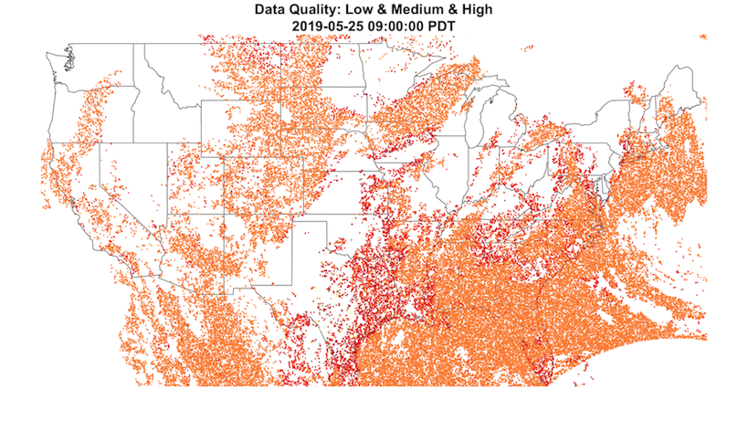

```{r setup, include=FALSE}
knitr::opts_chunk$set(echo = TRUE, fig.align = 'center')
```

Aerosol optical depth readings from the GOES-East satellite are each labeled
with a data quality flag ranging from 0 to 2 (high to low) with an additional 
flag, 3, for "no retrieval flag". Plotting data with no quality restrictions 
typically results in an image similar to the following:

<center>



</center>

While clouds and snow might leave many regions obscured, we can see that there
can be coverage for the whole continental United States. However, when plotting
*just* medium and/or high quality data we notice something interesting:

<center>


</center>

As expected, many points have been removed from the map, leaving every region 
much more bare than before. What is strange though is the culling of the entire 
West Coast. There isn't a single point left in Washington, Oregon, or
Idaho, and large parts of California, Nevada, and Montana are completely blank. 
This excluded region seems to be cut off by a fairly well-defined curve which 
arcs through North Dakota down towards southern California.

So what is this curved boundary and why does it exist? 

Due to GOES-East's geostationary orbit above 0.0N 75.0W, the satellite's ABI 
scanner is limited to viewing the fixed disk of the globe below it as displayed
by the diagram:

<center>


</center>

This results in a view skewed by the curve of the Earth. Southeastern states
like Florida can be scanned almost straight-on, but those on the opposite coast
like Washington, Oregon, and California can only be seen at a very shallow 
angle.

<center>


</center>

Part of what separates low quality readings from 
the rest are the local and solar zenith angles (LZA/SZA) of the data points. 
The LZA measures the 

<center>


</center>

https://www.goes-r.gov/products/docs/PUG-L2+-vol5.pdf p.246 (PDF 279)

Local zenith angle There are many ABI Level 2+ products where the angle between the line of
sight to the satellite and the zenith at the observation target has an adverse
effect on the quality of product data or precludes its generation. The local
zenith angle coordinates identify the specific angular constraints. These
coordinate values are stored in variables whose names have the string
“local_zenith_angle” and “local_zenith_angle_bounds”. Additional details on
the use of local zenith angle coordinate variables are discussed in paragraph
4.4.1 Local and Solar Zenith Angle Coordinate Variable Usage.
Solar zenith angle There are many Level 2+ products where the angle between the line of sight to
the sun and the zenith at the observation target has an adverse effect on the
quality of product data or precludes its generation. This coordinate is also used
to indicate day-only product data. These coordinate values are stored in
variables whose names have the string “solar_zenith_angle” and
“solar_zenith_angle_bounds”. Additional details on the use of solar zenith
angle coordinate variables are discussed in paragraph 4.4.1 Local and Solar
Zenith Angle Coordinate Variable Usage.
p.36 (PDF 69)

[Solar Zenith Angle](http://sacs.aeronomie.be/info/sza.php)