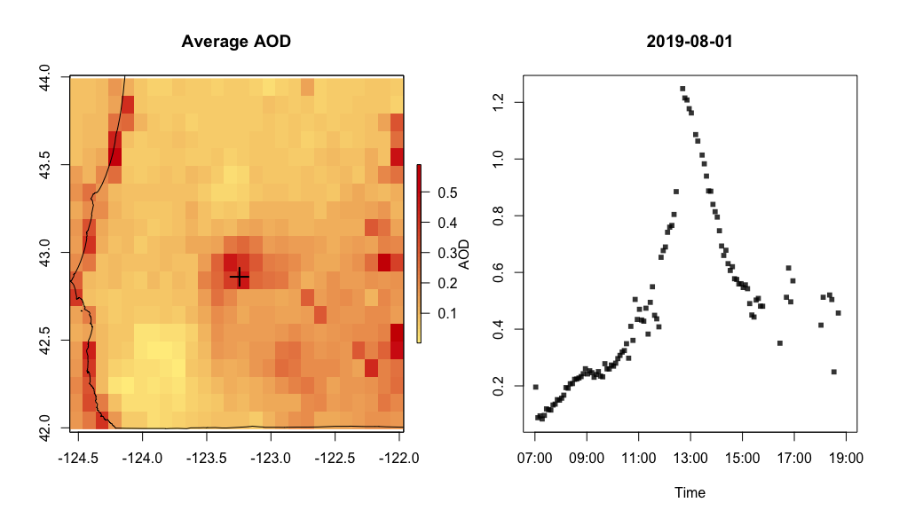

```{r setup, include=FALSE}
knitr::opts_chunk$set(echo = TRUE)
```

## Aerosol Optical Depth

Aerosol optical depth provides a measure of air quality by estimating the amount
of particles in a vertical column of the atmosphere. The absorbtion and 
scattering of certain spectral wavelengths on the atmosphere is fed into aerosol
models to determine an AOD value. This number is unitless, but values closer to 
0.0 correspond to a cleaner atmosphere while higher values correspond to more 
hazy conditions. An average AOD for the U.S. is usually around 0.1 and 0.15.

There are several limitations to this method. Sunlight is required for the
measurement process, meaning that AOD levels can't be estimated during 
nighttime. Additionally, many areas will have no AOD defined due to the 
reflectance of clouds or snow.

## AOD Source

The MazamaSatelliteUtils package uses AOD data provided by the Advanced 
Baseline Imager ([ABI](https://www.goes-r.gov/spacesegment/abi.html)) on board 
the GOES-16 satellite. This geostationary satellite is positioned to give the 
ABI a full view of the lower 48 states so that about every 5 minutes the imager
can complete a full scan of this region. The measurements of each individual 
scan are saved to a NetCDF file for that particular period in time.

More on the ABI's AOD measurement process can be found in the 
[GOES-R aerosol optical depth overview](https://www.star.nesdis.noaa.gov/goesr/product_aero_aod.php)
and the
[ABI AOD algorithm theoretical basis document](https://www.star.nesdis.noaa.gov/goesr/docs/ATBD/AOD.pdf).

## NetCDF Files

The "Common Data Form" filetype is used for efficient access to multidimensional
array-based data such as atmospheric measurements. A typical scan of North 
America holds 3,750,000 readings per variable, resulting in a file of around 3 
to 4 MB. If scans are taken every 5 minutes, a single day would hold about
12 files * 24 hrs * 3 MB = 860 MB worth of data. Due to this fairly large size, 
downloading a NetCDF using the `MazamaSatelliteUtils` package saves the file to a 
specified data directory from which the contents can be accessed through a file 
handle.

## MazamaSatelliteUtils Setup

Let's start exploring AOD data with the `MazamaSatelliteUtils` package. First 
we'll give ourselves a case study to focuson though, such as the recent Milepost
97 Fire. This incident was reported on July 24, 2019 about 1 mile southeast of 
Canyonville, Oregon and is still current as of August 11, 2019. This should 
provide plenty of data for us to examine in detail.

To begin our analysis, let's load the `MazamaSatelliteUtils` package and define
a `SatelliteDataDir`: A directory where all of our NetCDF files will be stored 
to and read from:

```{r satellite_setup, message=FALSE}
library(MazamaSatelliteUtils)
setSatelliteDataDir("~/Data/Satellite")
```

## Downloading Data and Creating NetCDF Handles

We can now start loading in satellite data using the `goesaodc_downloadAOD()`
function. For this we have to provide a datetime to specify which files we 
want. If the datetime is defined to the hour, then all of the NetCDF files 
generated in that hour will be downloaded. If just the date is given with no 
time specified, then all files generated during that entire day will be fetched.
In either case, any downloaded files will be stored in the `SatelliteDataDir` we
just defined.

Since downloading many NetCDF files can take a bit of time, for now let's only 
gather data for August 1, 2019 at 17:00:00 UTC (10AM PDT).

```{r download_files}
datetime <- lubridate::ymd_h("2019-08-01 17", tz = "UTC")
downloadedFiles <- goesaodc_downloadAOD(datetime, satID = 16)
```

The `goesaodc_downloadAOD()` function also returns a vector of paths to each 
downloaded file. However, if a file already exists in the `SatelliteDataDir` 
directory then it will not be downloaded again and will not show up in the 
returned vector. We can see which files are now availible to read by calling 
`goesaodc_listFiles()` on the datetime we specified:

```{r display_files}
dateFiles <- goesaodc_listFiles(datetime, satID = 16)
print(dateFiles)
```

In order to read the contents of a NetCDF file we will need a handle to access 
it by. This can be done by calling `goesaodc_openFile()` on the dataset 
filename, so let's open the first one in our downloaded time range 
`dateFiles[1]`:

```{r load_handle}
nc <- goesaodc_openFile(filename = dateFiles[1])
```

## Reading Through NetCDF Handles

Now that we have a handle to a netCDF file we can freely access readings from 
any of the variables in the dataset (listed by `names(nc$var)`) using the 
`ncvar_get()` function from the `ncdf4` package.

```{r ncdf4_retrival}
readings_aod <- as.numeric(ncdf4::ncvar_get(nc, "AOD"))
print(length(readings_aod))
print(range(readings_aod, na.rm = TRUE))
```

## AOD and DQF Data as a Tibble

For our purposes of mapping AOD values, we can consolidate all the data we 
need (longitude, latitude, and AOD) and make it even easier to access by forming
it into a tibble. The "DQF" variable will be included as well, which represents
the data quality flag for each reading. This flag can take one of the four 
following values:

* 0 - High quality
* 1 - Medium quality
* 2 - Low quality
* 3 - No retrieval flag
[source p.295](https://www.goes-r.gov/products/docs/PUG-L2+-vol5.pdf):

```{r create_tibble}
tb <- goesaodc_createTibble(nc)
knitr::kable(head(tb))
```

## Working With Data as Spatial Points

We can now finally start visualizing this data on geographic maps by creating 
and plotting spatial points from the AOD readings. Each spatial point represents
a single reading from the ABI's scan, so that each has a longitude, latitude,
AOD value, and DQF flag. Let's plot **all** of the points for our datetime
on a world map:

```{r spatialPlot_world}
sp <- goesaodc_createSpatialPoints(nc)

maps::map("world")
goesaodc_plotSpatialPoints(sp, add = TRUE, cex = 0.1)
```

As you can see, only the United States and Mexico have readings defined. 
The GOES-16 satellite can't scan beyond the disk visible below its geosynchrous 
orbit, so let's zoom in to just the U.S.:

```{r spatialPlot_usa}
maps::map(database = "state")
goesaodc_plotSpatialPoints(sp, add = TRUE, cex = 0.3)
```

Now that we have a clearer image of the points we can start to understand the
AOD values themselves. The `goesaodc_plotSpatialPoints()` function colors 
points according to their AOD value by default, but you can switch to DQF 
coloring by setting the `var` parameter to "DQF".
Additionally, when creating your spatial points you can also define the 
`dqfLevel` which subsets all points that are *at and below* the given level. 
Let's look at the points at level 0 (highest quality):

```{r spatialPlot_high_quality}
sp_dqf0 <- goesaodc_createSpatialPoints(nc, dqfLevel = 0)

maps::map("state")
goesaodc_plotSpatialPoints(sp_dqf0, add = TRUE, cex = 0.3)
```

As you can see, quite a bit of data has been removed since a good portion was 
marked as only medium or low quality. At this point let's zoom in all the way
to Oregon to check for signs of the Milepost 97 Fire (including all quality
levels). We'll need to use the `MazamaSpatialUtils` package to get the spatial 
data for the state and cull out-of-bounds points:

```{r spatialPlot_oregon, message=FALSE}
library(MazamaSpatialUtils)
setSpatialDataDir("~/Data/Spatial")
loadSpatialData("USCensusStates")

oregon <- subset(USCensusStates, stateCode == "OR")
bbox_oregon <- sp::bbox(oregon)
sp_oregon <- goesaodc_createSpatialPoints(nc, bbox = bbox_oregon)

lon_mp97 <- -123.268
lat_mp97 <- 42.913

plot(oregon)
goesaodc_plotSpatialPoints(sp_oregon, cex = 0.3, add = TRUE)
points(x = lon_mp97, y = lat_mp97, pch = 0, cex = 4.0, lwd = 1.5, col = "darkgreen")
```

## Rasterizing Spatial Points

A raster image divides geographic space into uniform pixels or "cells". A grid
is placed over a map and the value of each cell is calculated by aggregating the
values of all the spatial points that fall in that region. For example, if 20 
points are contained within one grid space, then all their AOD values could be 
averaged together to determine the resulting AOD of the raster cell. The uniform
grid size is defined by the resolution of the raster (in lon/lat degrees) such 
that higher resolutions reduce cell area and increase the detail and accuracy of
the final image.

Rasters provide the benefit of filling in undefined spaces around spatial 
points. They also make it easier to track the readings of specific locations
over time if the ABI doesn't scan the exact coordinates you are hoping to 
analyze.


```{r create_raster_highdef}
rstr <- goesaodc_createRaster(nc, bbox = bbox_oregon, res = 0.08)
pal_aod <- colorRampPalette(c("lightgoldenrod1", "red3"))

raster::plot(rstr$AOD, col = pal_aod(50))
plot(oregon, add = TRUE)
points(x = lon_mp97, y = lat_mp97, pch = 0, cex = 4.0, lwd = 1.5, col = "darkgreen")
```

The resolution of the raster is defined by latitudial degrees, so that setting
`res = 1` means every cell will be 1 latitudial degree tall, but may have 
varying widths due to how longitudes converge near the poles. The estimated area 
for each cell in km^2 cell can be approximated with `raster::area()`.

```{r cell_area}
approxCellArea <- mean(raster::values(raster::area(rstr)))
cellCount <- dim(rstr)[1] * dim(rstr)[2]
approxCellArea * cellCount
```

This slightly overestimates Oregon's true area of 255,030 km² due to the 
imperfect state bounding box and cell area approximation.

Resolutions closer to zero increase the image accuracy while larger values 
decrease it and produce more 'blocky' pictures (but are faster to generate).

## AOD Over Time

### Raster Stacks

So far we have only looked at a single instant from our original datetime. There
are still 11 other datasets from 16:00:00 that we can analyze like we did this 
one, but it's also possible to start combining data into either aggregated
rasters or time series plots. In both cases we first create a stack of rasters
by, again, defining an hour or date of interest. Let's stay with our current
hour:

```{r create_rasterStack}
rstrStack <- goesaodc_createHourlyRasterStack(startdate = datetime, satID = 16,
                                              bbox = bbox_oregon, res = 0.08)
```

This raster stack now contains individual layers for each downloaded dataset. We
can visualize them all at once using the `rasterVis` package:

```{r rasterStack_levelPlot, fig.width=8, fig.height=6}
rasterVis::levelplot(rstrStack)
```

Additionally, one can aggregate all of the rasters together to make one 
summarizing image, such as finding the mean AOD value for every pixel between 
scans.

```{r rasterStack_average}
rstrStackAvg <- raster::mean(rstrStack, na.rm = TRUE)
raster::plot(rstrStackAvg, col = pal_aod(50))
plot(oregon, add = TRUE)
points(x = lon_mp97, y = lat_mp97, pch = 0, cex = 4.0, lwd = 1.5, 
       col = "darkgreen")
```

### Time Series Plots

Finally, the `raster_createLocationTimeseries()` function allows us to track
AOD values of a specific location in each layer of a stack, resulting in a 
tibble of AOD values and their timestamps. There are a couple of ways of 
extracting this location data, however. The default method is to track the one
cell that the given coordinates fall into, chosen by setting the `method`
parameter to "simple". Additionally, one can set `method` to "bilinear", and
track the AOD interpolated between the 4 closest cells.

```{r timeseries_method}
datetimeLocal <- datetime
attributes(datetimeLocal)$tzone = "America/Los_Angeles"

ts_simple <- raster_createLocationTimeseries(rasterStack = rstrStack,
                                             longitude = lon_mp97, 
                                             latitude = lat_mp97, 
                                             bbox = bbox_oregon,
                                             method = "simple")

plot(x = ts_simple$datetime, y = ts_simple$aod, pch = 16, cex = 1,
     main = paste(datetimeLocal, "PDT"), xlab = "Time (local)", ylab = "AOD")
```

Aside from the two `method` options, we can instead define a `buffer`, which is
a circular area around our location that will aggregate the values of cells that
fall within it. Provide the `buffer`radius in meters and a `fun` aggregation
method such as mean, min, or max. `fun` is st to mean by default.

```{r timeseries_buffer}
ts_buffer <- raster_createLocationTimeseries(rasterStack = rstrStack,
                                             longitude = lon_mp97,
                                             latitude = lat_mp97, 
                                             bbox = bbox_oregon,
                                             buffer = 10000,
                                             fun = mean)

plot(x = ts_buffer$datetime, y = ts_buffer$aod, pch = 16, cex = 1,
     main = paste(datetimeLocal, "PDT"), xlab = "Time (local)", ylab = "AOD")
```

A time series plot with only 12 points isn't especially useful, though it can
help show the trend of the AOD values over a portion of a day. We are currently 
building a function that can create a raster stack for every daylight hour for a
given date, which has provided some very interesting insight so far!


